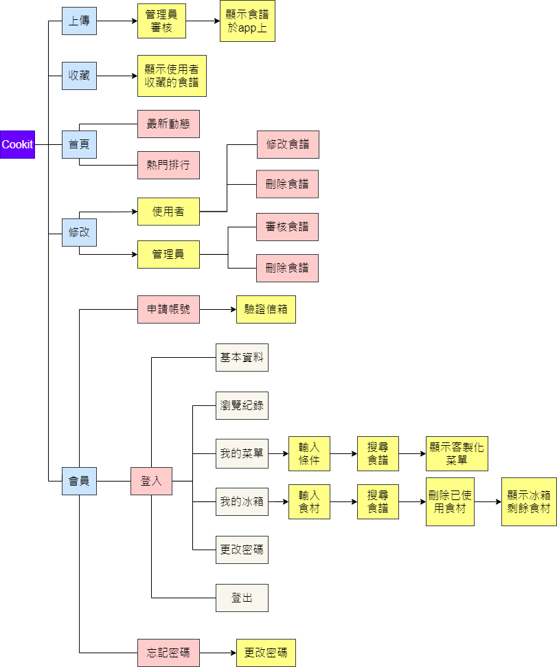
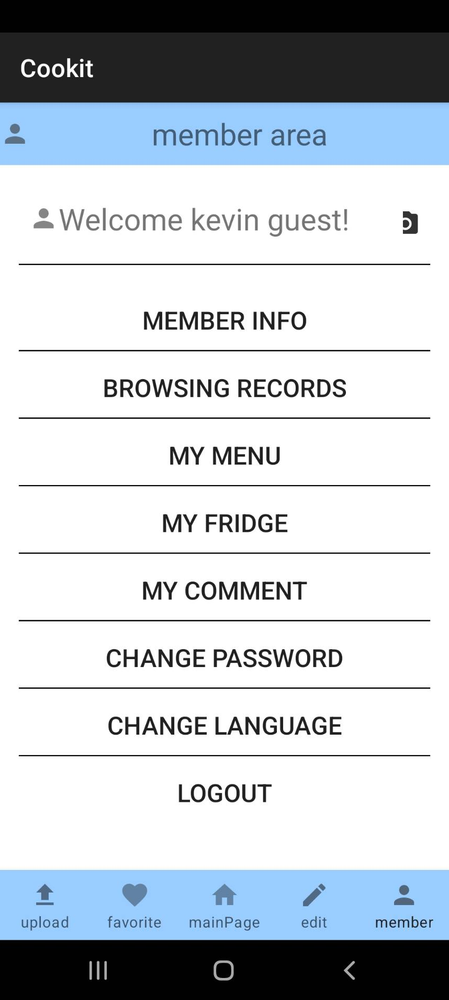

# Cookit

「Cookit」是一個跟食譜有關的Android APP，提供使用者以文字敘述或拍照的方式來分享自創的食譜，並且提供語音敘述食譜的功能，方便使用者烹飪、提供中英雙語介面供使用者切換、計算卡路里、可以從使用者設定的條件中設定客製化菜單與個人冰箱。

## Requirements

Android OS > 8.0

## Installation

直接將cookit.apk下載至任一Android行動裝置或模擬器中

## Architecture

## Usage

* 首頁
  

* 搜尋
  

* 上傳
  

* 修改/刪除
  

* 會員專區
  

* 英文介面
  

* 我的冰箱
  

* 客製化菜單
  
